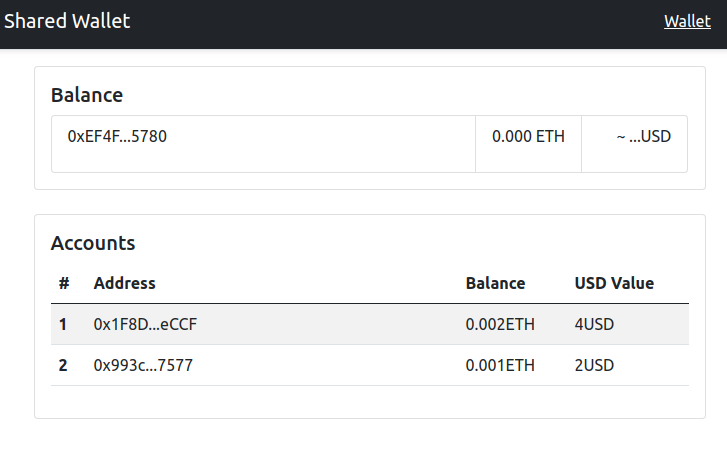

# Allowance Wallet

This project is an shared Wallet with allowance function, The goal is give
"allowance" to other, specific user-addresses (children, employees).


## Getting Started

### Prerequisites

- node.js
- npm
- truffle

### Installing

#### Compile/Migrate manually

- Install dependencies (OpenZeppeline)
  ```bash
  npm install
  ```
- Compile and migrate the contract

  ```bash
    truffle migrate
  ```

  > this will create a build folder and copy to client react.

#### Migrating using an alternative GUI blockchain with Ganash

For that it's necessary to have [Ganash software](https://www.trufflesuite.com/ganache) installed.

- Migrate the contract to the network.

  ```bash
    truffle migrate
  ```

  > check the configuration in `truffle-config.js`

  or intereacting with the console

  ```bash
   truffle console
   truffle(development)> test
  ```

## Built With

- [Truffle Framework](https://www.trufflesuite.com/docs/truffle/overview)
- [OpenZeppeline](https://github.com/OpenZeppelin/openzeppelin-contracts)

## TODO

[x] ~~Create Contract~~  
[x] ~~Create App client~~
[] Send Money from wallet

## Inspired by

- [Bitcoin Wallet](https://github.com/blockchainkatas/react-bitcoin-wallet/tree/master/src)
